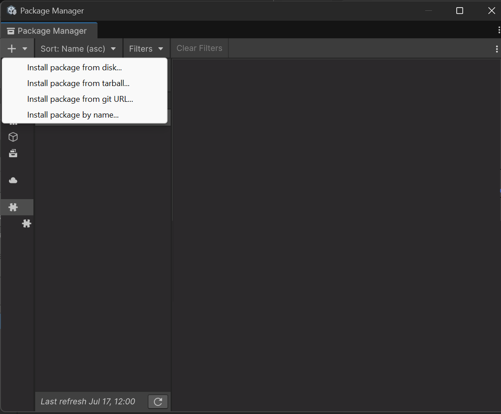
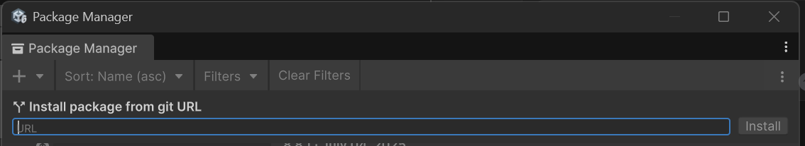
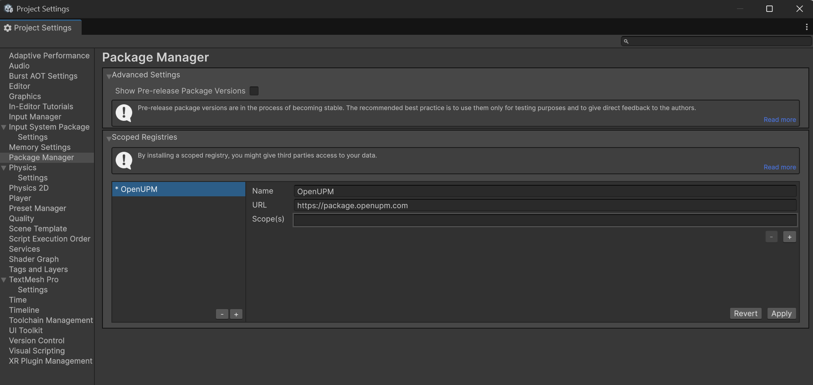
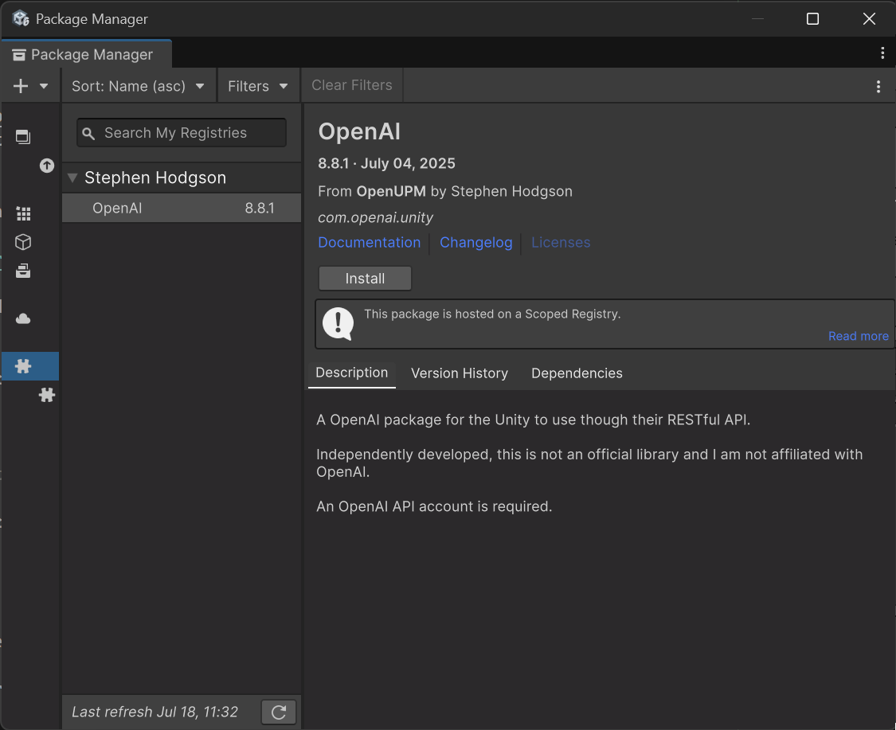

# Unity Packages (UPM files)

A UPM file is a file that contains content that can be added to a unity project.

While most often used for assets, plugins, and "scripts" (c# code), it can also be used to bring in assemblies into a Unity Project

# Potential issues:

## Unity's Built-in Reflection Support
Unity fully supports .NET reflection through the standard System.Reflection namespace. 
You can use `GetType()`, `GetField()`, `GetMethod()`, and other reflection APIs as you would 
in any .NET application. However, because Unity can strip out type information at build time, 
usage of reflection works better if the compiler/linker is aware of the types that are being reflected.

This shifts the possibility of using reflection to a compile time issue, rather than a runtime issue.

### Specific IL2CPP Limitations
When building for IL2CPP platforms (Android, iOS, WebGL, etc.), some reflection operations may not work as expected because IL2CPP 
performs ahead-of-time compilation and code stripping. 

If necessary, developers need to use `[Preserve]` attributes or `link.xml` files to ensure types and members aren't stripped.

## `System.Text.Json`
Testing has shown that the `System.Text.Json` serializer does indeed work with both the Mono and IL2CPP compilers, provided that 
the compiler can identify the types that are being serialized at compile time. 

The biggest issue is that there are a number of dependencies that are not included in the Unity SDK.

- **System.Text.Json**: Provides high-performance JSON serialization
- **System.Buffers**: Provides high-performance buffer management
- **System.IO.Pipelines**: Provides high-performance I/O pipelines
- **System.Memory**: Provides memory management utilities
- **System.Runtime.CompilerServices.Unsafe**: Provides unsafe compiler services
- **System.Text.Encodings.Web**: Provides web-safe text encoding

## Other dependencies required to support Fern generated SDKs in unity:

- **OneOf & OneOf.Extended**: Provides discriminated union types for better error handling
- **Microsoft.Bcl.AsyncInterfaces**: Provides async interface support for older .NET versions
- **System.Threading.Tasks.Extensions**: Provides task extension methods
- **portable.system.datetimeonly**: Provides DateTimeOnly support for older .NET versions

## Requirements for making a UPM package for binary assemblies
- the assemblies that you want to bring in must be compiled to work with .NET Standard 2.0 or 2.1 
- Additional assemblies that you need to bring in must be packaged inside the UPM package 
- Unity does not use NuGet, so you have to create a package in the format that it expects.

# Building a Unity Package

## Package Structure
Unity packages have a general structure that it expects, and is incredibly similar to NPM packages.

The basic package layout should look like this:
```  
<package-root>
  ├── package.json                                # Required - package manifest
  ├── README.md                                   # Required - package documentation
  ├── CHANGELOG.md                                # Optional - package changelog
  ├── LICENSE.md                                  # Optional - package license
  ├── Third Party Notices.md                      # Optional - package third party notices (important for redistributing other libraries)
  ├── Runtime                                     # Place assemblies in here
  │   ├── some-assembly.dll
  │   ├── some-assembly.pdb
  │   ├── some-assembly.xml
  │   ├── Internal                                # Place assemblies that are not part of the public API in here
  │   │   ├── some-internal-assembly.dll
  │   │   ├── some-internal-assembly.pdb
  │   │   ├── another-internal-assembly.dll
  │   │   ├── another-internal-assembly.pdb
  │   │   └── another-internal-assembly.xml
  ```

Optionally, you can add additional folders to support the editor, tests, samples and embed documentation
```
  ├── Editor
  │   ├── <company-name>.<package-name>.Editor.asmdef
  │   └── EditorExample.cs
  ├── Tests
  │   ├── Editor
  │   │   ├── <company-name>.<package-name>.Editor.Tests.asmdef
  │   │   └── EditorExampleTest.cs
  │   └── Runtime
  │        ├── <company-name>.<package-name>.Tests.asmdef
  │        └── RuntimeExampleTest.cs
  ├── Samples~
  │        ├── SampleFolder1
  │        ├── SampleFolder2
  │        └── ...
  └── Documentation~
       └── <package-name>.md
```
> Note: the `~` at the end of the folder names is a convention to indicate that the folder is hidden in the Unity Package Manager.

Binary assemblies that you want to expose to the developer should be placed in the `Runtime` folder.
Additional (dependency) assemblies that are not part of the public API should be placed in the `Runtime/Internal` folder. (this is a convention, not a requirement)

## Package Manifest - `package.json` 
Documentation: https://docs.unity3d.com/Manual/upm-manifestPkg.html

The package.json file is the root of the package, and contains the metadata for the package.

It is a JSON file that contains the following properties:

## `.meta` files
Along side every file or folder in the package, there should be a `.meta` file.
The `.meta` files are REQUIRED - Unity will give errors if the files are not present. 

At an absolute bare minimum, the .meta file should look like this:
```
fileFormatVersion: 2
guid: <40-character-guid>
```

The `guid` is a 40-character GUID that is used to identify the file. (This tool auto generates this based on the relative path of the file)

There are additional properties that can be added to the .meta file that instruct Unity how to handle the file, but they are not required for this purpose.

## Including "Scripts" in the package
Unity packages can contain "scripts" that are C# code that are built into the developer's project.

Currently, Fern generated SDKs do not contain any "scripts", but if they did, the `.cs` would be placed in the `Runtime` folder
and an `.asmdef` file would be required to tell Unity how to build the scripts.


## Optional Parts:
### Tests
[TBD]

### Samples
[TBD soon]


# Redistributing Custom UPM packages

Unity does not centralize the package management hosting, so you can't just add a package to Unity's repository.

The alternatives are: 
1. Hosting a git repository on github (or similar) 
2. Offer a hosted location for the .tgz UPM package file and have customers install it 
3. OpenUPM - a community-driven package manager and registry for Unity 

In reality, all three are a good idea, and #1 is _required_ #3 and makes #2 easier to implement. 

## User Installation Experience

#### Installing a package via the Unity UI
To install a third party package from a downloaded .tgz file or git repository the user needs to open the package manager, 
and click the "+" button which will show:



Notably: 
- Install Package From disk (a folder where an unpacked UPM file is located)
- Install Package From tarball (a UPM .tgz package file downloaded manually)
- Install Package From git (a git repository url)

This does not have any 'discover' features, so you have to have the URL or file to install already. 

Installing from a git repository:




### Package Discovery 
If you wish to be able to discover packages from the OpenUPM registry, there are two options:
 
#### 1. Via the command line using the `openupm-cli` tool 
Developers can install the `openupm-cli` tool via npm:

``` bash
$ npm install -g openupm-cli
```

and then are able to search from the command line

``` bash
$ openupm-cli search ai

notice ┌──────────────────────────────────────────┬────────────────────┬────────────┐
notice │ Name                                     │ Version            │ Date       │
notice ├──────────────────────────────────────────┼────────────────────┼────────────┤
notice │ com.srcnalt.openai-unity                 │ 0.2.2              │ 2024-07-18 │
notice ├──────────────────────────────────────────┼────────────────────┼────────────┤
notice │ com.prototyper.openai-editor-tool        │ 0.1.3              │ 2025-02-04 │
notice ├──────────────────────────────────────────┼────────────────────┼────────────┤
notice │ com.openai.unity                         │ 8.8.1              │ 2025-07-04 │
notice └──────────────────────────────────────────┴────────────────────┴────────────┘
``` 
To install a package, from inside the developer's project folder run the command (see `openupm-cli --help` for more options):

``` bash
$ openupm-cli add <package-name>
```

#### 2. Interactively via the OpenUPM website https://openupm.com/packages/ - which has a UI to search for packages, and each 
package page will have instructions on how to install the package - usually explaining the `openupm-cli` tool command and 
describing how to add via the Unity UI. 

To add a package via the Unity UI, the developer needs to first open the project settings, and add a new scoped registry:



A scoped registry is a means to add a package feed to the project, unlike other package management systems, you must
specify the individual 'scopes' (aka, namespaces) that you wish to see packages from.

Once that is done, the developer can go to the package manager in Unity and 

> ## WARNING:  
> Do not try to add a 'top-level' scope like `com` - this will trigger a very bad error in Unity because it thinks that
> all packages that start with `com` are from that feed, and ... this instantly breaks **everything** built in to Unity in the current project.

Once the scoped registry is added, the developer can go to the package manager in Unity and click in the area that is shown with a puzzle piece icon.



From there you can click install to install packages from that registry.


