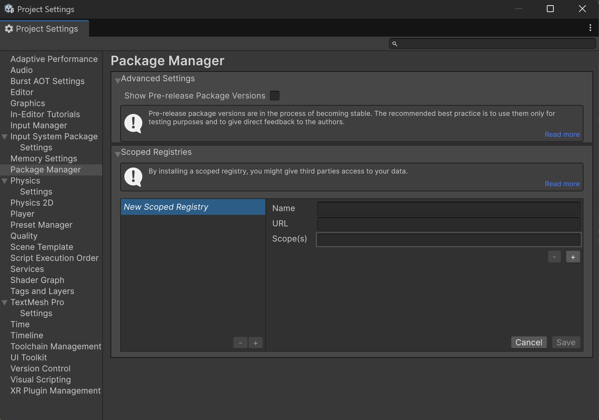

# ${displayName}

## Installing

Requires Unity 2021.3 LTS or higher.

The recommended installation method is though the unity package manager and [OpenUPM](https://openupm.com/packages/${name}).

### Via Unity Package Manager and OpenUPM

#### Terminal

```bash
openupm add ${name}
```

#### Manual

- Open your Unity project settings
- Add the OpenUPM package registry:
  - Name: `OpenUPM`
  - URL: `https://package.openupm.com`
  - Scope(s):
    - `${packageScope}`



- Open the Unity Package Manager window
- Change the Registry from Unity to `My Registries`
- Add the `${displayName}` package

### Via Unity Package Manager and Git url

- Open your Unity Package Manager
- Add package from git url: `${repoUrl}#upm`

---

## [Documentation](${documentationUrl})

